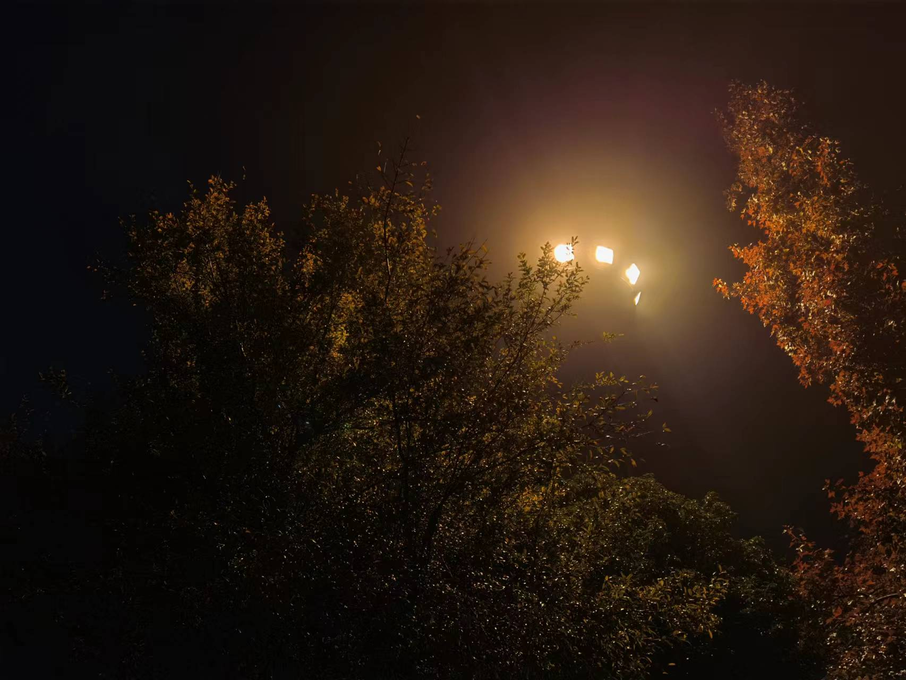

### Date: 2022/11/19
“破晓，融化，是一条通往春天的必经之路。”
<!-- more -->

窗上，泛起了层层薄雾，那是细雨留下来的些许痕迹。也许现在还未停吧。外面的宣传板上还悬挂着辩论赛的题目，很有趣，当你死前你会选择读一首诗还是见家人最后一面。第一感觉就是浪漫主义与现实主义的碰撞，细细想来，似乎又有些夸大化了。非常享受在夜深人静的黑夜里，带着耳机听着杉卉先生的音乐，温柔安静，写着心灵的流动，仿佛一切都静止在这里。  

仿佛从未见过这样的紫金港，晕晕灯光在雾中散发着忧伤，小雨为天空添上了面纱，一个人独自漫步于其中。不用考虑世事芜杂，偶然寻得一番清静。遇见看上去需要帮忙的情况，便顺手折返去助她一力，然后头也不回的离开。很开心。至少这份温暖能带给她一些慰藉，在这寒雨之中，也能给我空洞的心留下些许快乐的回忆。  

冬日已经在路上了，想做一个温柔的人呀。因为曾被温柔的人那样对待过，深深了解那种被温柔相待的感觉。对万事万物都可爱一点，对我喜欢的人开心地打个招呼，避开那些讨厌的人或事，不过还是勇敢的面对他们更好吧。 

哈哈，被子里暖烘烘的，甚至还有点热，生活还是要前进，没有把握住的一个又一个机会就让它过去吧。一辈子那么长，还有无数可能性等待我去探索。想到这里，很开心，也有了生活的热情。希望难过的时候，这些话还能记起。  

呼\~ 真不想结束呀，今晚又浪费了不少时光证实了我不喜欢某些事情，不必为了别人的邀约而耽误自身，当那个人不值得的时候。  

晚安，Dear.
