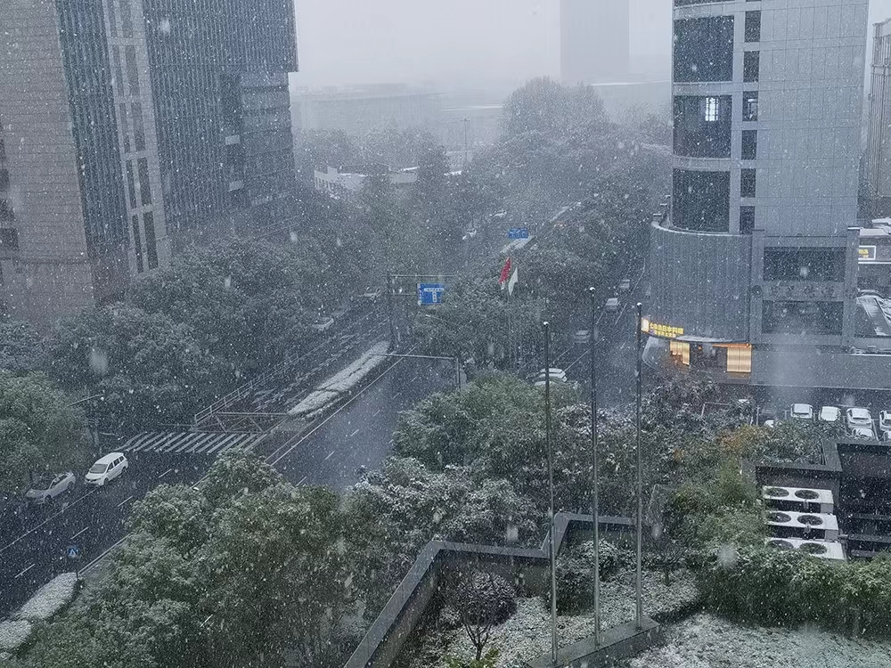

#### 初雪

似乎有些突然呢，今年的第一场雪。

<!-- more -->

尚且还处于隔离的状态中，蹲在房间的落地窗前，看雪花纷纷扬扬的撒下，心里十分新奇。于是暂且放下手中的琐事，记下此时的心绪。

很乱很乱，不知从何讲起。那就先分享一篇散文吧，康斯坦丁的《雪》。

原文如下：

> 雪
>
> [苏]康斯坦丁·帕乌斯托夫斯基
>
> 彼得洛芙娜搬来一个月后，波塔波夫老人就去世了。这座房子里就剩下彼得洛芙娜和她的女儿瓦丽娅。
>
> 这座只有三个房间的小屋坐落在山上，小屋后面是一座凋零的花园。
>
> 离婚后的彼得洛芙娜离开莫斯科以后，在很长一段时间里都不习惯这座空旷的小城。可是回莫斯科已经不可能了。她在这座小城的军医院找了事做，受伤的心也就暂时安定下来了。
>
> 渐渐地，她有点喜欢上这座小城了，喜欢上了这小城冬日里洁白、温柔的雪。她渐渐习惯了小屋里摆放着的那架走了调的钢琴，习惯了挂在墙上的那些业已发黄的照片。
>
> 她知道老人有一个儿子，如今正在黑海舰队上服役。桌上有一张他的照片。有时，她会拿起他的照片，端详一番，她总是隐约觉得似乎见过他，可是，是在哪里呢？是什么时候的事呢？
>
> 水兵那双安详的眼睛仿佛在问：“喂，怎么样？难道您真的想不起来，我们是在哪里相会的吗？”
>
> 冬天到来之后，陆续有写给波塔波夫老头的信寄来。彼得洛芙娜把这些信都叠放在书桌上。有一天夜里，她醒了过来。窗外的白雪发出昏暗的光亮。她点燃桌上的蜡烛，小心地抽出一封信，拆开了信封，环顾了片刻，便读了起来。
>
> “亲爱的老爷子，”她念道，“我从战场上下来已经在医院里躺了一个月了。伤不是很重。总的来说，伤快要养好啦。”
>
> “爸爸，我常常想起你，”她接着念下去，“我也常常想起我们家这座小屋，但这些离我似乎都非常遥远。我只要一闭上眼睛，立刻就会看到：我好像正在推开小门，走进花园。这是在冬天，白雪皑皑，可是通向那座旧亭子的小径被清扫得干干净净，钢琴当然已经修好啦，你把那些螺旋状的蜡烛插在了烛台上。钢琴上摆着的还是那些曲谱：《黑桃皇后》序曲和抒情曲《为了遥远的祖国的海岸……》。门上的铃还响吗？我走的时候还是没来得及把这修好。我难道还能再见到这一切吗？我明白，我在保卫的不仅是整个国家，也在保卫这个国家里的每一个角落，包括我们家的花园小屋。
>
> “我出院后，会有一个很短的时间回家探亲。我还不能确定。不过最好别等。”
>
> 她思忖，或许就在这两天内，这个陌生人就会从前线回来。
>
> 一大早，彼得洛芙娜就吩咐瓦丽娅拿起木铲去清理通向山坡上那座亭子的小径。这座亭子已经非常破旧了。彼得洛芙娜修理好了门铃，她按了按门铃，门铃响了起来，声音很大。她显得格外精神，面色绯红，说话嗓门特别大。她从城里请来了一位老技师，他修好了钢琴，说这确是一架好钢琴。
>
> 老技师走了之后，彼得洛芙娜小心翼翼地从抽屉翻找出一包粗粗的螺旋状蜡烛。她把蜡烛插到了钢琴架上的烛台上。晚上，她点燃蜡烛，坐到钢琴前，顿时，整个房子都充满了音乐声。
>
> 还在火车上，波塔波夫中尉就算好了，留给他待在父亲那儿的时间不超过一昼夜。火车是下午到达小城的。就在车站，中尉从认识的站长那儿了解到，父亲已经在一个月前去世了，如今在这座屋里住着的是一个带着女儿从莫斯科来的陌生的女歌唱家。站长建议中尉就别回家去了。
>
> 中尉沉默了一会，说了声“谢谢”，便走了出去。站长看着他的背影，摇了摇头。
>
> 穿过小城，一片暮霭中，波塔波夫终于走到了房子跟前。小心翼翼地打开小门，可是小门还是咯吱地响了一声。花园仿佛抖动了一下。树枝上有雪花簌簌飘落，沙沙作响。他环视四周。雪地里，一条已打扫干净的小径通向旧亭子，他不知不觉地走到了亭子里，把手放在年代已久的栏杆上。远方，森林的尽头，天空雾蒙蒙一片，呈现出粉红色的霞光，大概是月亮在云层后面慢慢升起的缘故。
>
> “怎么会是这样？”波塔波夫一脸茫然，轻声地自言自语道。
>
> 不知是谁小心翼翼地拍了拍波塔波夫的肩膀。他回过头去。在他身后站着一位年轻的女人。“进屋吧，别在这站着。”女人轻轻说。波塔波夫一言不发。女人拽着他的袖口，沿着打扫干净的小径走向小木屋。快到台阶的时候，波塔波夫停了下来，感到喉咙里一阵痉挛，几乎喘不上气来。女人还是那样轻柔地说道：“没关系。请您别拘束。很快就会过去的。”
>
> 他进了屋子。整个晚上波塔波夫都无法消除一种奇怪的幻觉，仿佛他处在一种飘然的、影影绰绰的，但却十分真实可靠的梦境中。钢琴、蜡烛……屋子里的一切都如他当初想看见的一样。
>
> 彼得洛芙娜坐到钢琴前，小心翼翼地弹奏了几曲，转过身，对波塔波夫说：
>
> “我觉得我好像在哪儿见过您。”
>
> “也许吧，”波塔波夫答道，“不过，想不起来啦。”
>
> 几天之后，彼得洛芙娜收到了波塔波夫写来的信。
>
> “我当然记得我们是在哪里相逢的，”波塔波夫写道，“可是我不想在家里对您说。您还记得1927年在利瓦季亚吗？在一条小道上，我只看了您一眼，您的倩影就永远刻在了我脑海里。当我看着您的背影远逝，我就知道，您是会让我的一生发生改变的人。可我当时不知为什么就是没有追上去。在这条小道上，我只看了您一眼，就永远失去了您。不过，生活看来对我还是很宽厚的，让我又遇上了您。如果能有一个美满的结局，如果您需要我的生命，那它当然是属于您的。”
>
> 彼得洛芙娜放下手中的信，两眼朦胧地望着窗外那白雪皑皑的花园，低声说道：
>
> “天呐，我从来没有去过利瓦季亚！从来没有！可是，现在这还有什么意义吗？该不该让他知道这一点呢？或者干脆欺骗一下我自己吧！”
>
> 她捂住自己的双眼，笑了起来。

记得曾经第一次读完这篇文章时，心中便充满了温暖。扑面而来的古朴气息，信件，雪花，蜡烛，钢琴，木屋，勾勒出了一幅独属于那个时代的风景画。而画中浪漫的青年和女子，更是在雪花的映衬下甚是温馨。

雪很美，浪漫无暇，给人无限的遐想。但现实中，雪是寒冷，是无情，给人以悲戚。

此刻外面天色已经暗了下来，雪花依旧飘舞着，也算是进了寒夜了。想到许许多多的人还在风雪中前行着，心中不免便多了一些难过和感动。当下的平稳，确是无数平凡人的付出所换来的，有人久久撑伞雨中，有人寒夜电话不止，只希望。

刚看到一则帖子，问人活着到底有什么意义。作为一个哲学问题，它已经存在了千年。千人千言，每个人对这个问题都有着自己独一份的答案。或者说，有很多人正在寻找自己的答案。也有丝毫不去考虑这个问题而痛痛快快的生活着的。这都无所谓，活得自在潇洒或是久久思索，那是个人的选择，无关你我。不过，对于那些思考过这个问题的人们，我想说，我也有和你们一样的感受，和你们问过同样的问题，现在也还在迷茫着，没有找到真正属于自己的答案。但是在找到之前，请勇敢的活下去，无问东西。

今天确是很冷的，我心至今也是冷的。

