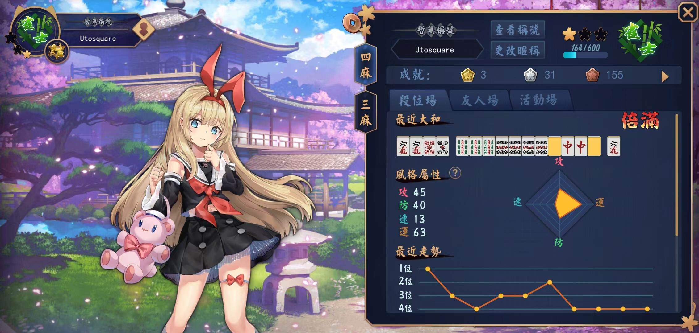

### 从入门到“入土”

#### 三麻篇

1. 三人麻将和四人麻将是截然不同的两个游戏，由于三麻中将2-9的字牌剔除并增加了拔北的机制，整个游戏的节奏是十分快的。很多时候牌娘发给玩家的都是二向听甚至于一向听的牌，就算不是，也可以迅速通过牌效率来停牌。
2. 三麻中，一般来讲，番数相较于四麻会十分大。这是由于2-9字牌的减少导致里宝牌，染手等一系列牌型的胡牌概率加大。经常可以见到立直，自摸，宝牌，里宝牌，混一色，役牌等同时出现。清一色，四暗刻，国士无双，大三元也不算太稀有。
<!-- more -->
3. 个人见解是三麻要快速门清立直，或者副露速攻，由于牌的数量减少，自摸的概率大大增加。(当然你胡的牌在别人手上成对或成刻的概率，以及在牌山的概率也相应的增加），顺带一提，最近胡牌总是至少三张在牌山里......无奈掉分
4. 在副露的时候要根据合适情况来选择，在牌很烂的时候，不要盲目碰牌，虽然铁头娃很常见，但我们相信运气不总是照顾他们。
5. 三麻里模糊牌型的确定（暂时）是容易的，很多时候都能判断出对手的牌大概听在什么位置，所以要观察对手的手切。

#### 四麻篇

1. 暂时想说的只有一点，不要在深夜打四麻，四连吃四的惨痛教训。

#### 2022/11/22

​	不要在恶调时打牌，要顺应自然规律，见好就收
​	不要上头，疯狂对攻，保持理智，每天最多一把。
