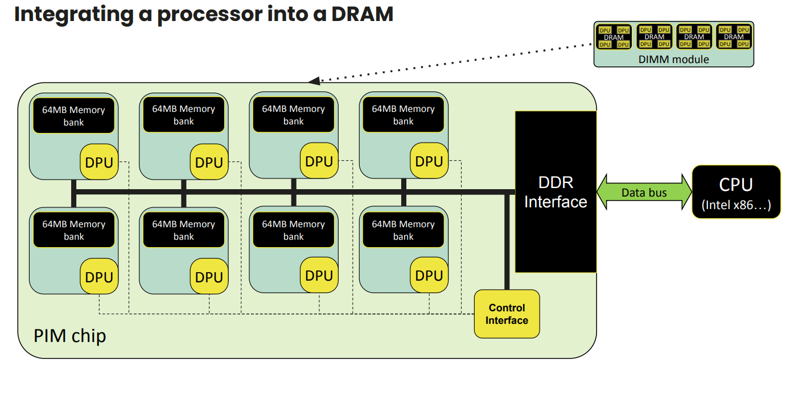
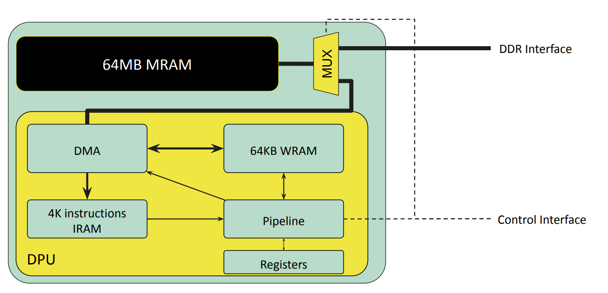
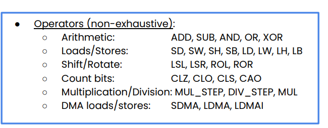

# PIM Learning

### Structure of DPU

从图中，可以看到，一个DIMM module上有多个DRAM chip，在一个DRAM chip中有多个Bank，给每个Bank加上一个DPU处理单元，在总线上加上一个control interface来对这些DPU进行控制。在一个DIMM中，所有chip共享同一根内存总线，一个chip内的所有bank可以同时跟CPU进行内存通信，即一个chip内的所有DPU可以跟CPU进行内存通信。



而在一个DPU中，有64MB的MRAM，64KB的WRAM和4KB的IRAM. 




由于DPU的硬件特性，在ISA上有以下特征:




+ No FPU
+ No vectorized instructions
+ Rich set of conditions for jump
+ 8x8 multiplication instruction, up to 32 ops for 32x32 

### Coding on UPMEM

[Standard library functions — UPMEM DPU SDK 2024.1.0 Documentation](https://sdk.upmem.com/2024.1.0/04_Stdlib.html)

#### Coding Tips
+ Runtime Library在重启启动时不会重置系统资源，包括Mutexes、semaphore和barrier counter
+ shorts和integers的乘法和除法代价很高
+ 尽量避免使用浮点和64位变量
+ 建议使用16个tasklet来减少内存访问的延迟
+ 每个 DPU 只能访问其自己的 MRAM 中的数据。建议组织数据流，使DPU执行尽可能独立于外部数据。
+ 与 DPU WRAM 的通信比与 MRAM 之间的复制慢。此外，与 MRAM 相比，WRAM 是更小的存储器。因此，DPU WRAM 应该用于共享少量数据。共享大缓冲区，应该使用copies to/from MRAM

#### 线程管理和同步

在UPMEM的DPU中，将线程抽象为Tasklet，提供了Mutexes, Semaphore, Barrier, Handshake的四种进程同步方法

**运行参数**

- `NR_TASKLETS` 用于定义tasklet的数量。
- `STACK_SIZE_DEFAULT` 用于定义所有未指定堆栈的tasklet的堆栈大小。
- `STACK_SIZE_TASKLET_<X>` 用于定义特定tasklet 的堆栈大小。

```shell
dpu-upmem-dpurte-clang -DNR_TASKLETS=3 -DSTACK_SIZE_DEFAULT=256 -DSTACK_SIZE_TASKLET_1=2048 -O2 -o tasklet_stack_check tasklet_stack_check.c
```

**Mutexes**

三个函数，初始化mutex，获取mutex，解锁mutex

```cpp
MUTEX_INIT(my_mutex);
mutex_lock(my_mutex);
mutex_unlock(my_mutex);
```

**Semaphore**

一般仅用于需要计数器同步的情况，`sem_take` 和 `sem_give` 分别减少和增加信号量计数器。如果计数器为零或小于零， `sem_take `会挂起调用的tasklet 执行，直到另一个tasklet 调用 `sem_give`

```cpp
SEMAPHORE_INIT(my_semaphore, 0);
sem_give(&my_semaphore);
sem_take(&my_semaphore)
```

**Barrier**

可以确保特定数量的tasklet在继续运行之前运行到同一起点上，先初始化barrier等待的tasklet数目，然后调用就可以wait

```cpp
BARRIER_INIT(my_barrier, NR_TASKLETS_NUMBER);
barrier_wait(&my_barrier);
```

**Handshake**

Handshake指的是可以实现在其中一个Tasklet完成特定任务后启动另一个Tasklet，通过wait_for和notify实现，其中wait_for的参数是tasklet通过`me()`方法获取的sysname_t

```cpp
handshake_wait_for(sysname_t notifier) 
handshake_notify(void)
```

#### **内存管理**

**内存模型**

在UPMEM的DPU中，有两种用途的Memory，分别是**WRAM**和**MRAM**，其中WRAM是程序执行时的内存，存放了stack, 全局变量和heap和手动分配的shared memory等资源，而MRAM可以被理解为“external peripheral”，访存速度较慢。

**WRAM Heap Allocation**

有三种allocator可以在WRAM上分配，分别是incremental allocator, fixed-size block allocator, buddy allocator.

+ Incremental allocator：使用这种allocator时，有几点需要注意
  + Runtime Library对于WRAM的组织方式是，除了program运行时所需的内存，剩余的所有内存都作为"free area"
  + 没有free方法，一个task动态申请一个Buffer后，这个Buffer会一直保留该task的property直到程序结束
  + `mem_reset()`方法用于clean-up heap，例如当一个DPU被程序多次启动时

```cpp
mem_alloc(size_t size)
mem_reset()
```

+ Fixed-Size block Allocator: 用于用户分配固定块大小的内存
  + 需要使用`fsb_allocator_t`，通过`fsb_alloc()`来分配空间，并通过`fsb_get()`来获取一个allocated block

```cpp
fsb_alloc(unsigned int block_size, unsigned int nb_of_blocks)
fsb_get(fsb_allocator_t allocator)
fsb_free(fsb_allocator_t allocator, void* ptr)    
```

+ Buddy Allocator: 即OS中提到的buddy allocation method
  + 分配的内存大小不能超过4096B，最小是32B，自动和DMA-transfer-size对齐

```cpp
buddy_init(unsigned int buffer_size)
buddy_alloc(unsigned int buffer_size))
buddy_free(char * memory)
```

**MRAM Management**

三种变量声明，`__mram, __mram_noinit, __mram_ptr`，前者将变量声明到MRAM上，中间代表该变量没有初始值，后者代表一个指针指向MRAM上的变量或者声明一个extern的MRAM variable.

在一般情况下，对于一个在MRAM中的8B变量，会由WRAM中的pre-defined cache来处理。**Implicit write access of MRAM variables**会经历如下三个过程：从WRAM cache中读8B，修改其中的x bytes，再把8B写回到cache中，并且8B以下的修改是非多线程安全的。

**Direct access to the MRAM**

主要由两个函数来操作：

+ 需要保证source和target的address都是8 bytes对齐的，并且transfer size必须是8的倍数，并且不能超过2048

```cpp
mram_write(const void *from, __mram_ptr void *to, unsigned int nb_of_bytes)
mram_read(const __mram_ptr void *from, void *to, unsigned int nb_of_bytes)
```

#### Exception

一个DPU Program可能因为三种fault停止，只能通过`dpu-lldb` 来打印stop reason，host API只能看到发生了错误

+ Memory fault

+ DMA fault

+ Runtime Library fault

#### Controlling the execuation of DPUs

**Allocation**

`dpu_alloc`: 分配指定数量的GPU

`dpu_free`: 释放一组由`dpu_alloc`分配的DPU

`dpu_get_nr_ranks`: 返回一个DPU set中的rank数量

`dpu_get_nr_dpus`: 返回一个DPU set中的DPU数量

**Loading Programs**

`dpu_load`：该函数输入一个二进制文件路径，加载二进制文件到指定的DPU上，并存储程序信息到给定的指针上。加载后，该程序持久保存在DPU内存中，可以由应用程序多次启动

`dpu_load_from_memory`：该函数加载一个在内存中的程序

**Executing Programs**

`dpu_launch`：该函数启动给定集合的所有DPU，某些资源会在启动前重置

+ `DPU_SYNCHRONOUS`：暂停应用程序，直到请求的 DPU 完成执行（或遇到错误）
+ `DPU_ASYNCHRONOUS` 立即将DPU的控制权交还给应用程序，应用程序将负责通过 `dpu_status` 或 `dpu_sync` 检查DPU的状态

#### Communication with host applications

**Memory Interface**

使用这些内存传输函数存在一些限制：

+ IRAM和MRAM地址要求8B对齐，WRAM地址要求4B对齐
+ symbol name是DPU code中的WRAM或者MRAM变量名组成
+ 与 DPU WRAM 的通信比与 MRAM 之间的复制操作更慢。此外，与 MRAM 相比，WRAM 是更小的存储器。因此，DPU WRAM 应该用于共享少量数据，大数据应放到MRAM中
+ 每个DPU只能访问自己的MRAM中的数据，所以DPU执行应尽可能独立于外部数据

`dpu_copy_from(struct dpu_set_t set, const char *symbol_name, uint32_t symbol_offset, void *dst, size_t length)`: 从DPU上copy到buffer中

`dpu_broadcast_to(struct dpu_set_t set, const char *symbol_name, uint32_t symbol_offset, const void *src, size_t length, dpu_xfer_flags_t flags)`：将一个buffer广播到所有DPU中

`dpu_push_xfer(struct dpu_set_t set, const char *symbol_name, uint32_t symbol_offset, const void *src, size_t length, dpu_xfer_flags_t flags)`：在一次传输中将不同的buffer传输到一组DPU中

**Rank Transfer Interface**

`dpu_prepare_xfer`：将buffer属性赋给一组DPU，可以在`dpu_push_xfer`方法中使用

`dpu_push_xfer`：使用之前定义的缓冲区，按照给定方向，DPU symbol name，DPU symbol length进行传输

#### Advanced Features of Host API

**Multiple Ranks Transfer**

在一个具有多个DPU rank的DPU set中，使用copy function默认会使用多线程来进行copy操作这些Multi-ranks operation，可以以下方式禁用：

```cpp
dpu_alloc(DPU_ALLOCATE_ALL, "nrThreadsPerRank=0", &dpu_set);
```

**Asynchronism**

`dpu_broadcast_to`和`dpu_push_xfer`可以通过将`dpu_xfer_flags_t `设置成`DPU_XFER_ASYNC`(默认是`DPU_XFER_DEFAULT`)来将这些操作变为异步操作，rank可以独立的完成transfer操作。在同步模式下，API会等待set中的所有rank完成一个操作后才会执行另一个，异步模式会独立的管理每个rank。

`dpu_sync`：使用该函数可以等待DPU set中的所有rank的异步操作执行完成

**Callback**
```cpp 
dpu_error_t dpu_callback(struct dpu_set_t set, dpu_error_t (*fct)(struct dpu_set_t set, uint32_t rank_id, void *arg), void *arg, dpu_callback_flags_t flags);
```

`dpu_callback`：该回调函数允许用户在一些异步操作之间进行函数调用，根据不同的flags会产生不同的行为
+ DPU_CALLBACK_DEFAULT: 默认情况下，`dpu_callback`函数会在DPU set中的每个rank上执行一次，并等待所有rank执行完毕
+ DPU_CALLBACK_ASYNC：每个rank的`dpu_callback`调用独立进行，不会等待，需要调用`dpu_async`进行同步
+ DPU_CALLBACK_ASYNC | DPU_CALLBACK_NONBLOCKING：对于NONBLOCKING来说，该回调独立于之后发起的任何`dpu_callback`,`dpu_sync`不会等待该回调结束，需要由用户来确保完成。同时，hostAPI需要更多的线程资源来处理同时运行的多个callbacks，所以需要修改`dpu_alloc`中的`nrThreadsPerRank `

+ DPU_CALLBACK_ASYNC | DPU_CALLBACK_SINGLE_CALL: 与常规的异步行为相同，但是他只会对相同的DPU Set上执行一次回调函数
+ DPU_CALLBACK_ASYNC | DPU_CALLBACK_SINGLE_CALL | DPU_CALLBACK_NONBLOCKING: 


#### Logging 
**Logging from dpu-lldb**

在DPU程序中直接`printf`即可

**Logging from Host**

`dpu_log_read(struct dpu_set_t set, FILE *stream)`: 使用该函数，可以将DPU程序中的log打印到文件中(stdout)，但是只有在`DPU_FOREACH`中才能使用这个函数。潜在风险在于，Log保存在DPU的MRAM的circular buffer中，在主机端调用时当程序的完整LOG大于缓冲区大小时，会发生错误

可以使用`STDOUT_BUFFER_INIT(size)`来设定缓冲区大小

#### Measuring performances
RUNTIME Environment提供了一套函数，可以检测硬件性能计数器。可以通过`CLOCKS_PER_SEC`将DPU周期计数转换成时间(秒)。该变量在DPU端可用，也可以通过拷贝在主机端使用。第二个
+ perfcounter_config
  + COUNT_CYCLES: 周期包括指令的执行时间和内存传输
  + COUNT_INSTRUCTIONS：计算已用的指令
  + COUNT_SAME
  + 第二个变量设置为true，代表重置计数器，否则代表保留当前计数器值
+ perfcounter_get: 返回计数器值

一个使用例子：host测量了DPU程序中循环的执行时间
```c
#include <perfcounter.h>
#include <stdio.h>

__host uint32_t nb_cycles;

int main() {

  perfcounter_config(COUNT_CYCLES, true);

  int loop = 1e7;
  while (loop)
    loop--;

  nb_cycles = perfcounter_get();

  return 0;
```

```c
****#include <dpu.h>
#include <stdio.h>
#include <time.h>

#ifndef DPU_BINARY
#define DPU_BINARY "./frequency_example"
#endif

static inline double my_clock(void) {
  struct timespec t;
  clock_gettime(CLOCK_MONOTONIC_RAW, &t);
  return (1.0e-9 * t.tv_nsec + t.tv_sec);
}

int main() {
  struct dpu_set_t set, dpu;

  DPU_ASSERT(dpu_alloc(1, NULL, &set));
  printf("DPU allocated\n");
  DPU_ASSERT(dpu_load(set, DPU_BINARY, NULL));

  double start = my_clock();
  DPU_ASSERT(dpu_launch(set, DPU_SYNCHRONOUS));
  double end = my_clock();

  // retrieve number of cycles on DPU
  uint32_t nb_cycles;
  DPU_FOREACH(set, dpu) {
    DPU_ASSERT(
        dpu_copy_from(dpu, "nb_cycles", 0, &nb_cycles, sizeof(uint32_t)));
  }

  // retrieve DPU frequency
  uint32_t clocks_per_sec;
  DPU_FOREACH(set, dpu) {
    DPU_ASSERT(dpu_copy_from(dpu, "CLOCKS_PER_SEC", 0, &clocks_per_sec,
                             sizeof(uint32_t)));
  }

  printf("DPU cycles: %u\n", nb_cycles);
  printf("DPU time: %.2e secs.\n", (double)nb_cycles / clocks_per_sec);

  printf("Host elapsed time: %.2e secs.\n", end - start);

  DPU_ASSERT(dpu_free(set));
  return 0;
}
```

### Debuging on UPMEM

#### Supported Commands in dpu-lldb
+ `process launch`: Start a DPU program
+ `process continue`: Resume a DPU program
+ `process interrupt`: Stop a DPU program
+ `thread list`: List all the threads of a DPU and where each thread is at
+ `thread select`: Select a thread as the currently active thread
+ `thread step-in`: Source level single step in current thread
+ `thread step-over`: Source level single step in current thread, stepping over calls
+ `thread step-inst`: Single step one instruction in current thread
+ `thread step-inst-over`: Single step one instruction in current thread, stepping over calls
+ `thread step-out`: Finish executing the function of the currently selected frame and return to its call site
+ `thread until`: Run the current or specified thread until it reaches a given line number or address or leaves the current function
+ `thread backtrace`: Show the stack of the current thread
+ `frame select`: Select a frame by index from within the current thread and make it the current frame
+ `frame info`: List information about the currently selected frame in the current thread
+ `frame select --relative=<n> or up <n>`: Go up “n” frames in the stack (1 frame by default)
+ `frame select --relative=-<n> or down <n>`: Go down “n” frames in the stack (1 frame by default)
+ `frame variable`: Show frame variables
+ `target variable`: Read global variables for the DPU program
+ `breakpoint set|list|delete`: Manage breakpoint in the DPU program
+ `register read`: Dump the contents of one or more register values from the current frame
+ `register write`: Modify a single register value
+ `memory read`: Read from the memory of the DPU program
+ `memory write`: Write to the memory of the DPU program
+ `disassemble`: Disassemble specified instructions of the DPU program

一些dpu-lldb常见操作：

```shell
dpu-lldb
process launch --stop-at-entry
process continue
frame variable/x checksum
target variable/x checksum
breakpoint set --source-pattern-regexp "return"
parray/x 20 &input[0]
memory read
memory write -i sample.bin '&buffer[0]'
```

内存映射：DPU的所有内存都会映射到`dpu-lldb`中的一个地址空间, IRAM需要通过`disassemble`来读取
+ WRAM: `0x00000000 - 0x00010000`
+ MRAM: `0x08000000 - 0x0c000000`
+ IRAM: `0x80000000 - 0x80008000`

