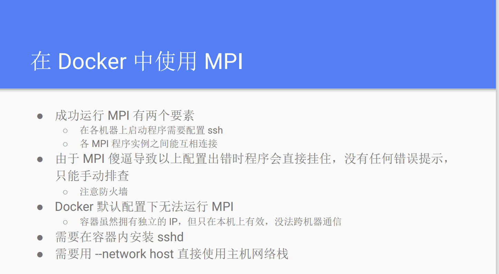

# Docker Notes

[Docker-从入门到实践，非常不错](https://yeasy.gitbook.io/docker_practice)
[中文官方文档](https://www.dockerdocs.cn/)


## Install on Debian12
参照[官网教程](https://docs.docker.com/engine/install/debian/)

```bash
# Add Docker's official GPG key:
sudo apt-get update
sudo apt-get install ca-certificates curl
sudo install -m 0755 -d /etc/apt/keyrings
sudo curl -fsSL https://download.docker.com/linux/debian/gpg -o /etc/apt/keyrings/docker.asc
sudo chmod a+r /etc/apt/keyrings/docker.asc

# Add the repository to Apt sources:
echo \
  "deb [arch=$(dpkg --print-architecture) signed-by=/etc/apt/keyrings/docker.asc] https://download.docker.com/linux/debian \
  $(. /etc/os-release && echo "$VERSION_CODENAME") stable" | \
  sudo tee /etc/apt/sources.list.d/docker.list > /dev/null
sudo apt-get update

sudo apt-get install docker-ce docker-ce-cli containerd.io docker-buildx-plugin docker-compose-plugin
```

## Docker基本命令

### 1. 容器使用
#### 退出容器快捷键
```sh
CTRL+P CTRL+Q
```

#### 基本命令
```sh
docker ps -a #查看所有容器
docker container ls #查看所有正在运行中的容器

docker start CONTAINER_ID/NAME #启动一个已停止的容器
docker stop CONTAINER_ID/NAME #停止容器
docker restart CONTAINER_ID/NAME #重启容器
docker rm -f CONTAINER_ID/NAME #删除容器

docker exec -it CONTAINER_ID/NAME /bin/bash #进入容器
docker attach CONTAINER_ID/NAME #进入容器, 不推荐使用，因为退出容器终端后会导致容器的停止

docker export CONTAINER_ID/NAME > ubuntu.tar #导出容器到asc.tar
cat docker/ubuntu.tar | docker import - test/ubuntu:v1 #导入容器
docker import http://example.com/exampleimage.tgz example/imagerepo:v1 #从指定URL或目录导入容器

docker port CONTAINER_ID/NAME port #查看容器内某个端口映射情况
```

#### 新建容器
运行示例：
```sh
docker run -v ~/hpc:/workspace/hpc  --name hpc_2310 -itd --gpus all --privileged --shm-size=4g  nvcr.io/nvidia/hpc-benchmarks:23.10 
```
该命令可额外设置的参数较多，主要可分为容器管理，网络设置，CPU/GPU和内存的Runtime，以及权限和LXC配置，此处仅列举较常使用的参数:
+ -v: 挂载目录，格式为：主机目录:容器目录
+ -p 127.0.0.1:32109:5000/udp: 端口映射，格式为：网络地址(默认是本机):主机端口:容器端口，默认绑定tcp端口。
+ -P: 随机端口映射，将expose的端口随机映射到主机的端口上
+ -itd: i代表交互模式，t代表为容器重新分配一个伪输入终端，d代表后台运行
+ --name：容器名称
+ -h: 指定容器hostname
+ -e: 设置环境变量，格式为VARIABLE="VALUE"
+ --env-file=[]: 从指定文件读入环境变量；
+ -m: 设置最大内存使用
+ --cpuset="0-2" / --cpuset="0,1": 绑定容器到指定CPU核心
+ --network="bridge"/name: 指定容器的网络连接类型，支持 bridge/host/none/container，或者连接到指定网络
+ --expose=[]: 声明容器将暴露的端口，仍需进行端口映射
+ --dns=114.114.114.114 --dns-search=DOMAIN: 设置容器DNS，以及搜索域
+ --rm：容器退出时自动清除容器内的文件系统，如挂载的目录，等价于容器推出后docker rm -v CONTAINER_ID


### 2. 镜像使用
#### 获取镜像
```sh
docker pull pytorch/latest
docker pull -a #下载一个仓库中所有镜像 tag
docker pull --disable-content-trust true #禁用镜像验证
docker pull --platform=linux/arm64 #设置镜像所属平台   
```
默认情况下，docker pull 命令从 Docker Hub 下载镜像。如果要使用镜像源，或者修改`/etc/docker/daemon.json `如下：
```sh
#添加镜像源
sudo vim /etc/docker/daemon.json 
{
    "registry-mirrors" : [
    "https://registry.docker-cn.com",
    "http://hub-mirror.c.163.com",
    "https://docker.mirrors.ustc.edu.cn",
    "https://cr.console.aliyun.com",
    "https://mirror.ccs.tencentyun.com"
  ]
}
#重启Docker服务
$ sudo systemctl daemon-reload
$ sudo systemctl restart docker
```

#### 基本命令
```sh
docker images #查看所有镜像
docker image ls keyword #列出和关键词相关的镜像

docker rmi imgae_name #删除镜像
docker commit -m="New Version" -a="Squarehuang" CONTAINER_ID/NAME asc24:v1  #从容器导出镜像
docker diff CONTAINER_ID/NAME #查看容器存储层的改动

docker tag ubuntu:18.04 username/ubuntu:18.04:dev #给镜像打标签

docker save alpine | gzip > alpine-latest.tar.gz #保存镜像并用gzip亚索
docker load -i alpine-latest.tar.gz #加载镜像

```

#### DockerHub使用
```sh
docker login #登录DockerHub
docker logout #退出
docker search keyword #在DockerHub上搜索关键词为keyword的镜像
```

### 3. Docker容器互联
#### Docker四种网络类型
+ bridge: 默认网络，容器默认使用的网络, 这个网络类型为容器提供了隔离的网络环境。
  + 每个容器都会分配一个虚拟的以太网接口，并连接到 Docker 的默认桥接网络（通常是 docker0）
  + 容器之间可以通过 IP 地址互相通信
  + 容器可以通过 NAT（网络地址转换）访问外部网络
  + 容器与宿主机可以通过端口映射（port mapping）进行通信
  
+ host: 容器共享主机的网络，使用 host 网络的容器将不会获得自己的 IP 地址，而是使用宿主机的 IP 地址。
  + 网络性能更高
  + 容器端口和宿主机端口是相同的, 共享相同的网络栈
+ none: 为容器提供一个完全隔离的网络环境。容器将不会连接到任何网络，也不会分配任何网络接口。
  + 只有一个回环接口lo
+ container:container_name : 使一个容器共享另一个容器的网络命名空间。使用这种网络模式的容器将与指定的容器共享 IP 地址和网络接口。
  + 两个容器共享相同的网络栈，拥有相同的 IP 地址。

#### 查看容器网络
```sh
docker network ls
```

#### 新建Docker网络并连接
+ -d: 指定Docker网络类型，bridge/overlay
+ 可以给多个container创建一个Bridge，让它们能够互联
```sh
docker network create -d bridge net-name
docker run -itd --name test1 --network  net-name ubuntu /bin/bash
```
+ 配置容器dns: 需要修改/etc/docker/daemon.json
```sh
# /etc/docker/daemon.json
{
   "dns" : [
    "114.114.114.114",
    "8.8.8.8"
  ]
}
# /etc/resolv.conf 查看dns配置情况
domain internal.zjusct.io
search internal.zjusct.io complement.com
nameserver 172.25.2.253 
```


## Docker打包指南
#### 基本命令
构建名称为image_name的镜像，`.`指定的是Context的路径，包括本地文件和Dockerfile，`-f`参数指的是Dockerfile的名称, 应该存在上下文路径中, `--no-cache`告诉Docker不要使用缓存来构建镜像
```sh
docker build -t image_name . -f Dockerfile_specific .
docker build -t hello-world https://github.com/docker-library/hello-world.git#master:amd64/hello-world #从Git repo构建镜像，指定分支是master，构建目录是amd64/hello-world
docker build - < context.tar.gz #从上下文压缩包中进行构建
```
从当前容器导出镜像,实际上是在原来镜像的基础上，将当前容器的存储层叠加，构成新的镜像。但这种经由docker commit生成的镜像称为"黑箱镜像",它有两大坏处：
+ 构建历史不明：无法得知从原有镜像上执行了什么操作来生成了新镜像，导致镜像无法维护
+ 体积庞大：由于存储层的叠加，新镜像的体积会比原有镜像大很多。而且，除了目标操作，实际上可能有大量的无关内容被添加进来，从而增大了镜像的体积。
```sh
docker commit -m="New Version" -a="Squarehuang" CONTAINER_ID/NAME asc24:v1  #从容器导出镜像
docker history CONTAINER_ID/NAME #查看镜像提交历史
docker diff CONTAINER_ID/NAME #查看容器存储层的改动
```
**所以最好的方式就是通过Dockerfile来构建镜像...**

#### Dockerfile编写指南
[Dockerfile官方文档](https://docs.docker.com/reference/dockerfile/)
每一个Docker的构建都需要编写一个Dockerfile，Dockerfile编写要点参考如下：
+ `FROM`: FROM从某个镜像开始构建，也可以是`scratch`，代表不需要从任何已有镜像构建
```sh
FROM scratch
```
+ `RUN`: RUN命令执行一次就是一层，所以尽量将多个命令合并成一个命令，减少镜像层数。并且在执行后，要对当前层引入的无关文件进行清空，例如apt缓存文件，任何在在下一层无关的东西都应该在当前层执行最后清理掉。
```sh
RUN echo '<h1>Hello, Docker!</h1>' > /usr/share/nginx/html/index.html
RUN ["/bin/sh", "-c", "echo '<h1>Hello, Docker!</h1>' > /usr/share/nginx/html/index.html"]
```
+ `COPY`: 将上下文目录中源路径的文件/目录复制到目标路径中，会保留源文件的各种元数据。
```sh
COPY [--chown=<user>:<group>] <源路径>... <目标路径>
COPY [--chown=<user>:<group>] ["<源路径1>",... "<目标路径>"]
COPY --from=nginx:latest /etc/nginx/nginx.conf /nginx.conf # COPY也可以从某个镜像中复制文件
```
tips:如果源路径为文件夹，复制的时候不是直接复制该文件夹，而是将文件夹中的内容复制到目标路径
+ `CMD`: 用于指定容器主进程的启动命令
```sh
CMD <command> <param1> <param2> #Shell格式默认用sh -c进行执行，所以参数都会交给Shell解析
CMD ["Executable","Param1","Param2"]
CMD <param1> <param2> # 指定EntryPoint后
```
tips: 此处需要指出，Docker和虚拟机不同，容器本质上是一个进程，因此容器中并没有后台服务的概念，应用都应该以前台执行。所以CMD的命令应该是一个一直运行的前台服务，否则主进程运行结束后容器随之退出
+ `ENTRYPOINT`: 用于指定容器启动时执行的命令，可以通过`docker run --entrypoint`覆盖，会将`CMD`的内容作为参数传递给`ENTRYPOINT`指令，实际执行时变成
```sh
# Dockerfile
ENTRYPOINT "<CMD>"
```
+ `ENV`: 设置环境变量
```sh
# Dockerfile
ENV VERSION=1.0 DEBUG=on \
    NAME="Happy Feet"
```
+ `ARG`: 设置环境变量，但是`ARG`设置的环境变量在将来容器运行时是不存在的。`docker build --build-arg=`
```sh
# Dockerfile
# 只在 FROM 中生效
ARG DOCKER_USERNAME=library
FROM ${DOCKER_USERNAME}/alpine

# 要想在 FROM 之后使用，必须再次指定
ARG DOCKER_USERNAME=library
RUN set -x ; echo ${DOCKER_USERNAME}
```
+ `VOLUME`: 定义匿名卷，避免向容器存储层中写入大量数据，任何向VOLUME中写入的信息都不会记录进容器存储层
+ `EXPOSE`: 声明容器运行时提供服务的端口，但并没有实际映射
+ `WORKDIR`: 更改之后的RUN、CMD、ENTRYPOINT、COPY和ADD指令的工作目录。如果是相对路径，则与上一个WORKDIR相关。
```sh
# Dockerfile
WORKDIR /app
WORKDIR test
```
+ `USER`: 更改RUN、CMD、ENTRYPOINT、COPY和ADD指令的执行用户。用户必须事先建立好。root用户执行的脚本，若希望更换身份，建议使用`gosu`
```sh
# Dockerfile
# 建立 redis 用户，并使用 gosu 换另一个用户执行命令
RUN groupadd -r redis && useradd -r -g redis redis
# 下载 gosu
RUN wget -O /usr/local/bin/gosu "https://github.com/tianon/gosu/releases/download/1.12/gosu-amd64" \
    && chmod +x /usr/local/bin/gosu \
    && gosu nobody true
# 设置 CMD，并以另外的用户执行
CMD [ "exec", "gosu", "redis", "redis-server" ]
```
+ `HEALTHCHECK`: 通过该指令指定一行命令，用这行命令来判断容器主进程的服务状态是否还正常，从而比较真实的反应容器实际状态。
和`CMD`,`ENTRYPOINT`一样，`HEALTHCHECK`也是只能有一个，如果有多个，只有最后一个生效。
```sh
# Dockerfile
FROM nginx
RUN apt-get update && apt-get install -y curl && rm -rf /var/lib/apt/lists/*
HEALTHCHECK --interval=5s --timeout=3s --retries=3 \
  CMD curl -fs http://localhost/ || exit 1

# 查看健康检查命令的输出
docker inspect --format '{{json .State.Health}}' CONTAINER_NAME/ID | python -m json.tool
```
+ `ONBUILD`: 该命令后的Docker指令只会在以当前镜像为基础镜像，去构建下一级镜像的时候才会执行
+ `SHELL`: 该命令指定了`RUN`、`CMD`、`ENTRYPOINT`的默认shell
```sh
SHELL ["/bin/sh", "-cex"]
```

#### Docker多阶段构建
`as`: 使用`as`来为某一阶段命名，当只想构建`builder`阶段的镜像时，可以增加`--target=builder`参数
`COPY --from=0 /go/src/github.com/go/helloworld/app .`: 从上一阶段的镜像中复制文件
```sh
FROM golang:alpine as builder
RUN apk --no-cache add git
WORKDIR /go/src/github.com/go/helloworld/
RUN go get -d -v github.com/go-sql-driver/mysql
COPY app.go .
RUN CGO_ENABLED=0 GOOS=linux go build -a -installsuffix cgo -o app .

FROM alpine:latest as prod
RUN apk --no-cache add ca-certificates
WORKDIR /root/
COPY --from=0 /go/src/github.com/go/helloworld/app .
CMD ["./app"]
```

## Docker内使用MPI
......还没实践过


## Docker Compose实践
`Compose`项目是Docker官方的开源项目，负责实现对Docker容器集群的快速编排，即「定义和运行多个 Docker 容器的应用」。
`Compose`中有两个关键概念：

+ 服务 (service)：一个应用的容器，实际上可以包括若干运行相同镜像的容器实例。

+ 项目 (project)：由一组关联的应用容器组成的一个完整业务单元，在 docker-compose.yml 文件中定义。

`docker-compose.yml`：Compose使用的主模板文件

### 基本命令
+ -f, --file FILE 指定使用的 Compose 模板文件，默认为 docker-compose.yml，可以多次指定。
+ -p, --project-name NAME 指定项目名称，默认将使用所在目录名称作为项目名。
+ --verbose 输出更多调试信息。
+ -v, --version 打印版本并退出。

```sh
docker compose build #重新构建项目中的服务容器
  --force-rm #删除构建过程中的临时容器
  --no-cache #构建镜像过程中不使用 cache
  --pull     #始终尝试通过 pull 来获取更新版本的镜像。
docker compose config #验证 Compose 文件格式是否正确
docker compose down   #停止up命令的启动容器，并移除网络
docker compose images #列出Compose文件中的包含的所有镜像
docker compose kill -s SIGKILL/SIGINT/SIGTERM #停止服务容器
docker compose logs #查看容器输出，不同容器颜色不一样
docker logs -f -t --tail 10 CONTAINER_ID/NAME #实时查看容器输出，带时间戳，后十行
docker compose port  [options] SERVICE PRIVATE_PORT 
  --index=index #指定多个容器中所要打印的容器序号，默认为1
docker compose ps
  -q #只打印ID信息
docker-compose restart #重启项目中的服务
docker-compose rm      #删除所有服务容器
docker-compose up -d   #后台启动并运行所有的容器
```

### docker-compose.yml编写指南

每个服务都必须通过 image 指令指定镜像或 build 指令（需要 Dockerfile）等来自动构建生成镜像。
```sh
# docker-compose.yml(image)
services:
  webapp:
    image: examples/web
    ports:
      - "80:80"
    volumes:
      - "/data"
```
此处展示了常见的所有容器build时的参数：[参考手册](https://yeasy.gitbook.io/docker_practice/compose/compose_file#qi-ta-zhi-ling)
```sh
# docker-compose.yml(build)
services:
  webapp:
    build: 
      context: ./dir
      dockerfile: Dockerfile-build
      args: 
        buildno: 1
      entrypoint: /code/entrypoint.sh
      user: nginx
      working_dir: /code
      domainname: example.com
      hostname: test
      mac_address: 02:42:ac:11:00:02
      privileged: true
      restart: always
      read_only: true
      tty: true
      cache_from:
        - alpine:latest
        - corp/web_app:3.14
      cap_add:
        - ALL
      commands: echo "hello world"
      container_name:  docker-web-container(default: 项目名称_服务名称_序号)
      depends_on:
        - db
        - redis
      dns:
        - 8.8.8.8
      dns_search:
        - domain1.example.com
      tmpfs:
        - /run
      env_file:
        - ./common.env
      environment:
        - DEV_ENV=development
      expose:
        - "3000"
      extra_hosts:
         - "dockerhub:52.1.157.61"
      healthcheck:
        test: ["CMD", "curl", "-f", "http://localhost"]
        interval: 1m30s
        timeout: 10s
        retries: 3
      labels:
        com.startupteam.release: "rc3 for v1.0"
      network_mode: "bridge"
      networks:
        - some-network
      ports:
        - "3000"
        - "8000:8000"
      volumes:
        - mysql_data:/var/lib/mysql
      secrets:
        - db_root_password
  db:
    image: "mongo:${MONGO_VERSION}"
  redis:
    image: redis

  secrets:
    file: ./my_secrets.txt
```
除此之外，还包括`domainname, entrypoint, hostname, ipc, mac_address, privileged, read_only, shm_size, restart, stdin_open, tty, user, working_dir`，基本和`docker run`中对应参数功能一致

## Docker Swarm
一个用于管理多个装有Docker的机器的集群的软件，未完待续......
